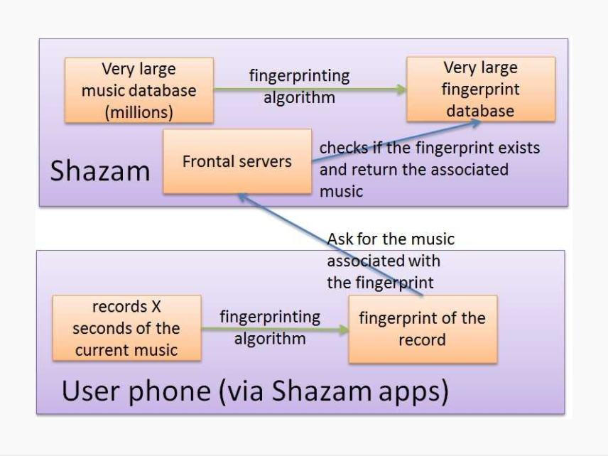

# Spotify "Dream" Design

## Application Description
Spotify is a digital music service that enables users to listen to millions of different songs, from various record labels, on laptops, smartphones, and other devices. Although Spotify is primarily subscription-based, it has two versions of its service: free and premium. The usability of the free version varies on different devices. For example, on a smartphone, the user can only play songs on random; they would have to touch the “Shuffle Play” button to hear a queue of randomly selected songs. However, on a desktop, laptop, or tablet, the user is able to select any song they would like to listen to. The downside to the free version is that there are a lot of advertisements, which can be irritating and interruptive. In Spotify Premium, the user can not only choose whatever song they want to play, they can also listen to their music with no interruptions. 

The music service, that hosts over 30 million tracks, currently has many great features to it. Some of these include: searching for a specific song, adding songs to and naming playlists, saving songs and albums, starting a radio channel based on a song, artist, or playlist, and browsing through different genres and popular playlists. In addition, the app is very social. You can follow your friends’ profiles and be able to view their public playlists and what songs they have been listening to recently. A favorite feature is the ability to download songs, so that you can play them later without the use of Internet connection. This is especially convenient for users with limited data plans and spotty Wi-Fi. Although Spotify already has many components, there are two features that would make the application more advanced, creating the utmost level of interaction with its users: voice and music recognition.

The application can approve on two main usability heuristics: reducing the user’s cognitive workload and providing efficiency for tasks. By adding in voice recognition, it allows for a hands-free interaction with the app. It becomes significantly easier and faster to say what you are looking for rather than taking the time to try and locate it manually. As for the music recognition component, the user can identify an unknown song in a short period of time, and immediately be able to save, share, or add that song to a playlist or queue.

### Web Service(s) Used
This “dream” design will require a few web services to support the functionality of the application. ACRCloud can be used for the music recognition feature. Automatic Content Recognition (ACR) is “an identification technology to recognize content played on a media device or present in a media file. This enables users quickly obtain detailed information about the content they have just experienced without any text based input or search efforts. ACR can help users deal with multimedia more effectively and make applications more intelligent.” (ACRCloud Docs). ACR uses audio fingerprinting to quickly identify an audio sample within a specific audio database. 

  
Figure 0

The documentation explains how their fingerprinting algorithm works. Figure 0, from above, is an example of how Shazam's music recognition works. Fingerprints are digital features that are taken out of audio clips. These fingerprints are distinctive, so that the system can recognize which audio they belong to. Once the user records a song on the application, the fingerprinting algorithm is set in motion. It asks for the music that is associated with that fingerprint, from the large database of fingerprints. Once it has found a match, it returns back the appropriate song. 

ACRCloud's music recognition service is the perfect way to find music by sound or humming. Its API is currently compatible with Spotify’s music services. Various API calls can be used to integrate this recognition feature directly onto Spotify. Two of these calls, in particular, would be startRecordRec and stopRecordRec, which would be implemented into the functions startRecognition and stopRecognition, respectively. Recognition modes can also be toggled for certain situations; rec_mode_remote is for live detection, while rec_mode_local is for offline use. These calls can be used to identify music within Spotify’s music database, creating a more efficient way to find music.

For the speech recognition audio player, Google’s Speech API can be used. This application program interface is a speech recognition system that supports about 80 languages. It can "transcribe the text of users dictating to an application’s microphone, enable command-and-control through voice, or transcribe audio files, among many other use cases. Recognize audio uploaded in the request, and integrate...audio storage on Google Cloud Storage, by using the same technology Google uses to power its own products." (Google Cloud Speech API). The words PLAY, PAUSE, and STOP are key words that would start or stop audio streaming. These words are connected with their respective buttons on Spotify, so the application can correctly identify the user’s commands.
	
Both of these APIs are used with Spotify’s Web API, which allows you to fetch data from the Spotify music catalog and manage users’ playlists and saved music.

## Top-Level Design/Layout
Affordances play a huge role in the design of digital interfaces. By understanding affordance, the designer can better understand product and interaction design. According to Crowdcube, an affordance is “a situation where an object’s sensory characteristics intuitively imply its functionality and use.” (Borowska 2015). The visual appearance of an application could possibly be its most important aspect, as it triggers an interaction between the user and the application. For this reason, the designer has to cleverly and carefully create objects, whether in physical or digital space, thoroughly implying to the user how they should be used.

  Figure 1 and 2

For this reason, I chose to use a button with a microphone on it, for the speech recognition feature, since users typically associate microphones with speaking. It is located at the top left corner of the "Home" tab, as demonstrated in Figure 1. A prompt appears in the center of the application, after the user clicks on or touches the microphone, to provide the client feedback.
	
By implementing this, it tells the user that the button is clickable and produces an action. The prompt, which includes example commands, provides clear guidelines on not only what the user should be doing, but also what he or she could be doing.

  Figure 3 and 4

Similarly, by including the music recognition feature as one of the tabs at the bottom of the screen, i.e. "Find Song", demonstrated in Figures 3 and 4 above, it indicates to the client that it is also a button that can be clicked. When users click on the button, it highlights green, so that they know they are currently on the page of the button they just touched. On this page, there is a circle in the middle, with a language cue, to signify that it should be clicked in order to identify music. When the application is in the process of recognizing a song, the black lines in the center of the green circle slowly fade in one by one to also provide the user feedback. To account for errors, an exit button, marked as an "x", is located at the top right hand corner of the page. Incase the user did not mean to click on the green circle, the "x" can lead him or her back to the previous page. Once the song is identified, it will direct to the page of the song in Spotify’s database.

## Usage Scenarios
### Identifying a Song
The most appropriate situation for when this feature would be used, is when the user is at location where a song is playing, and he or she likes the song, but does not know what the name of it is. For example, if the user is at a party and a song comes on, they can use the music recognizer to identify that song in seconds. 

Performing this task is very simple, since a tab for this component has been created. The user will click on the “Find Song” tab, which will lead to the page demonstrated in Figure 3. Once they reach that page, users will click on the green circle, as directed in the description. After the button is pressed, the circle will animate, with the inside black lines slowly fading in one by one, to indicate to the user that the click has triggered an action. The animation will continue until the song has been identified within Spotify’s music catalog. If the reader is unable to find the song, it will return a message informing the user that the song is not available. Additionally, if the song is unclear or not loud enough, it will ask the user to update and try again. Once the song has been found, the user will be directed to the page that contains the description of the song, i.e. Figure 5 below.

  
Figure 5

From there, the user can save the song, directly add it to a playlist, add it to a queue, share it with friends, create a radio station from it, or go to the artist’s page to find more songs by that specific artist. In addition, the songs that the recognizer finds will be stored in a folder, incase the user needs to access it again. To find this folder, the user will click on the “Your Library” tab in which a link, titled “Identified Songs”, will lie. When the user clicks on that button, they will be able to scroll through all the songs they found through the identifier. 

### Verbally Playing a Song
The speech recognizer is most useful in a hands-free or on-the-go setting. Instead of spending time going through the tabs and searching for specific songs or playlists, the user can just click on the microphone to be able to find these more easily. This can be very useful and efficient if the user wants to play a song in their car while they are driving. Instad of taking their eyes off the road, they can click on the microphone button to direct the application. The microphone button is located in the “Home” tab on the top left hand corner, demonstrated in Figure 1. After that button is clicked, as shown in Figure 2, the background will fade out and a prompt will appear in the center of the screen. The application will be waiting for a command from the user. Example commands are provided underneath the prompt as guidelines for users. To play a specific song by a certain artist, the instruction would be, “Spotify, play Cold Water by Major Lazer.” Furthermore, if they want to pause or stop the song, users will just say “Stop” or “Pause”.

If users clicked on the microphone button by accident, several things have been incorporated to account for this error. For example, the word “Spotify” is added in front of the play commands, so that the application does not pick up on words from conversation and start playing songs. This would especially be useful when the user is in a silent setting, such as a classroom or library. Alternatively, if the user clicks the microphone and wants to exit out of it, he or she can click on the faded portion of the screen, and will be directed back to the home page.

## Design Rationale
The main concern for these two designs was *convenience* for the user. The music recognition feature is something that is already available in many other applications, such as Shazam and SoundHound. By adding it directly on Spotify, they will no longer have to download additional applications onto their devices, which can be an issue when storage starts filling up. Also, when users Shazam or Hound songs, they tend to forget to go back to them later to save or download to their devices, since they cannot directly do it from those apps. When this feature is on Spotify, users can immediately save or add the popped up song to a playlist to listen to later. In addition, when they go to stream their music, they can easily navigate to the folder of all the identified songs, incase they were unable to save it before. 

Similarly, the voice recognition component is very convenient, as it is hands-free and easy access. As mentioned earlier, users do not have to spend time locating songs or playlists; they can use the microphone to easily and quickly find what they are looking for. This can be handy in many situations, especially when the user’s hands are occupied.

## Usability Metric Forecast
The four main priority metrics that arose while creating this “dream” design are memorability, efficiency, learnability, and errors. This design’s strongest metrics are efficiency, learnability, and memorability. The user should not have a hard time with the application once they have used it for the first time, as it is easy to retain and reproduce. The buttons are not hard to identify and they clearly imply their functionality. As mentioned before, microphones are associated with speech, so the user can assume speaking is involved with that button. In addition, the “Find Song” tab at the bottom is easy to explore to see what it does. Once the user reaches the pages for the music and voice recognizers, the language cues will guide them to use the functions properly. Furthermore, these designs make Spotify more efficient, because users are able to spend less time finding and playing songs. In addition, they do not have to navigate through multiple apps to recognize and save their music.

The weakest metric of the interface design is errors. With all the clues and visual cues, it’s inevitable to encounter user error. That is why it is important to try and dodge these mistakes as much as possible. One thing that could be an issue is the mispronunciation or misunderstanding of words that can trigger incorrect results. The user might get frustrated if they have to repeat their commands.

## References
"ACR (Automatic Content Recognition)." ACRCloud Docs. N.p., n.d. Web. 05 Dec. 2016. <https://www.acrcloud.com/docs/introduction/automatic-content-recognition/>.

Borowska, Paula. "6 Types of Digital Affordance That Impact Your UX." Webdesigner Depot. N.p., 06 Apr. 2015. Web. 05 Dec. 2016. <http://www.webdesignerdepot.com/2015/04/6-types-of-digital-affordance-that-impact-your-ux/>.

"Cloud Speech API." Google Cloud Platform. N.p., n.d. Web. 05 Dec. 2016. <https://cloud.google.com/speech/>.

"Spotify Web API." Spotify Developer. N.p., n.d. Web. 05 Dec. 2016. <https://developer.spotify.com/web-api/>.
